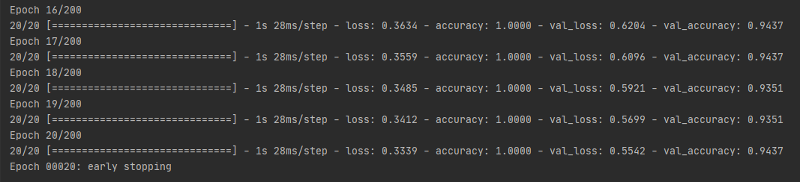

# Speech_Recognition

First we extract the *Mel-Frequency Cepstral Coefficients (MFCCs)* from the audio data, then train a deep *Convulutional Neural Network (CNN)* over those features to predict the speaker. The dataset contains 60 samples from 24 individual actors and is available from [kaggle here](https://www.kaggle.com/uwrfkaggler/ravdess-emotional-speech-audio).

### RESULTS

My best model had a validation accuracy of over 90%. We can see in this image that training stopped early, this is because of the early_stopping callback we implement in the code. After no improvement over a given amount of epochs, training is stopped early.

Here is a visualization of accuracy (including val_accuracy) and loss (including val_loss) over the training epochs.
